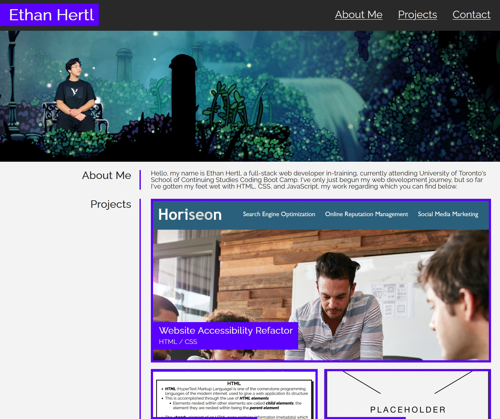

# Module 2 Weekly Challenge - Professional Coding Portfolio

## Description

A well-put together portfolio showcasing one's coding skills is an enormous asset for a job search in the web development field. Not only does a good portfolio give potential employers an insight into your abilities and thought process, but having several web applications deployed is often the baseline requirement for a company to give you an interview. As such, I put together a portfolio showcasing some of the web development projects I've worked on thus far, and set it up such that I can add new projects or replace old ones easily in the future. I've also included a short About Me section to introduce myself, and contact information.

## Usage

View my coding portfolio here;

### LINK GOES HERE ONCE DEPLOYED ETHAN

Scroll down to see a short About Me section, followed by some of my work and contact information. Alternatively, click the subtitles in the header to jump directly to the appropriate section. To view alternative text for images, open your browser's DevTools menu (F12 / Control + Shift + I on Windows, or Command + Option + I on MacOS, required key input may differ depending on your browser), and navigate to the appropriate section.

## Preview

## Credits

raleway font (index.html, line 20);
https://fonts.google.com/specimen/Raleway

placeholder image (./assets/images/placeholder-image-transparent.png);
https://www.figma.com/community/file/941607221092508263

reset.css file (./assets/reset.css);
https://meyerweb.com/eric/tools/css/reset/

## License

Operates under a standard MIT license, refer to the LICENSE file in the repository for more information.

